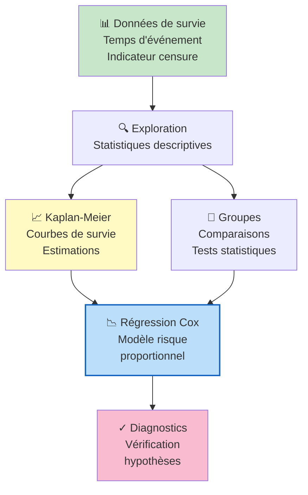

# Analyse de Survie — JBKP Data Analysis Project

## _Introduction_

Ce rapport présente une **analyse de survie complète** sur un dataset contenant des données de suivi longitudinal. L'analyse de survie est une branche de la statistique qui se concentre sur l'étude du temps écoulé avant la survenance d'un événement d'intérêt. Elle est largement utilisée dans les domaines médicaux, actuariels, et de fiabilité des systèmes.

### Objectifs et contexte

L'objectif de ce projet est d'analyser :

1. **Les courbes de survie** : Estimer la probabilité de survie en fonction du temps
2. **Les facteurs de risque** : Identifier les variables qui influencent la survie
3. **Les modèles de régression** : Quantifier l'effet des covariables sur le risque
4. **Les comparaisons de groupes** : Tester les différences de survie entre sous-groupes

Le rapport HTML fourni contient les analyses détaillées, visualisations et résultats statistiques.

---

## _Contenus principaux_

### Sections du rapport

1. **Exploration des données** : Statistiques descriptives du dataset
2. **Estimation Kaplan-Meier** : Courbes de survie non-paramétriques
3. **Tests de comparaison** : Log-rank test et autres tests de sélection
4. **Modèles de risque proportionnel** : Régression Cox
5. **Diagnostics** : Vérification des hypothèses du modèle

### Techniques utilisées

- **Estimateur de Kaplan-Meier** : Probabilité de survie
- **Courbes de survie** : Visualisation par groupes
- **Tests statistiques** : Log-rank, Wilcoxon
- **Régression de Cox** : Modèle semi-paramétrique
- **Résidus de Cox-Snell** : Vérification des hypothèses

---

## _Accès et consultation_

Le rapport complet est disponible dans le fichier HTML : **A.AYOUBI_JBKP_ANALYSEDESURVIE.html**

### Comment ouvrir le fichier

1. **Double-cliquez** sur le fichier `.html` pour l'ouvrir dans votre navigateur par défaut
2. **Ou faites un clic-droit → Ouvrir avec → Navigateur web**
3. Le rapport affichera tous les résultats, graphiques et tableaux dans un format interactif

### Navigation dans le rapport

- Utilisez la **table des matières** pour naviguer rapidement entre sections
- Les **graphiques et tableaux** sont intégrés directement
- Vous pouvez **imprimer ou exporter** le rapport depuis votre navigateur

---

## _Contenu détaillé_

### Statistiques descriptives

- Nombre d'observations et de variables
- Nombre d'événements observés vs censurés
- Distribution des temps de suivi
- Caractéristiques par groupe

### Courbes de Kaplan-Meier

- Estimation non-paramétrique de la survie
- Intervalles de confiance
- Comparaison entre groupes
- Visualisations professionnelles

### Modèles de régression

- **Modèle de Cox** : Risque proportionnel
- **Coefficients** : Effets des covariables
- **Rapports de hasard (HR)** : Interprétation quantitative
- **Intervalles de confiance** : Précision des estimations

### Tests et diagnostics

- **Log-rank test** : Comparaison de groupes
- **Résidus diagnostiques** : Vérification d'hypothèses
- **Proportionnalité des risques** : Validation du modèle

---

## _Diagrammes et visualisations_

Le rapport contient plusieurs visualisations clés :

---

## _Méthodologie statistique_

### Estimateur de Kaplan-Meier

$$S(t) = \prod_{t_i \leq t} \left(1 - \frac{d_i}{n_i}\right)$$

où $d_i$ = nombre d'événements au temps $t_i$, $n_i$ = nombre à risque

### Modèle de Cox

$$h(t|X) = h_0(t) \exp(\beta_1 X_1 + \beta_2 X_2 + \ldots)$$

où $h_0(t)$ = risque de base, $\beta$ = coefficients de régression

---

## _Conclusion_

Ce rapport fournit une analyse complète de la survie avec tous les outils statistiques nécessaires pour comprendre les patterns de survie et l'effet des facteurs de risque.

**Auteur** : Ahmed Ay  
**Type** : Analyse de Survie (Survival Analysis)  
**Format** : Rapport HTML avec visualisations interactives
