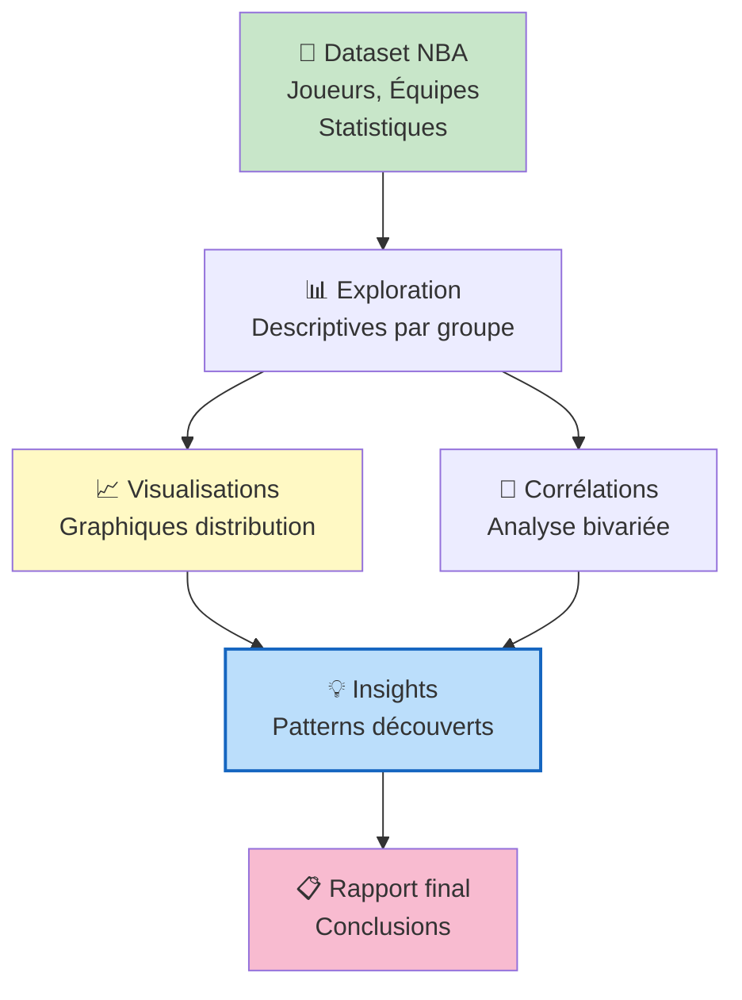
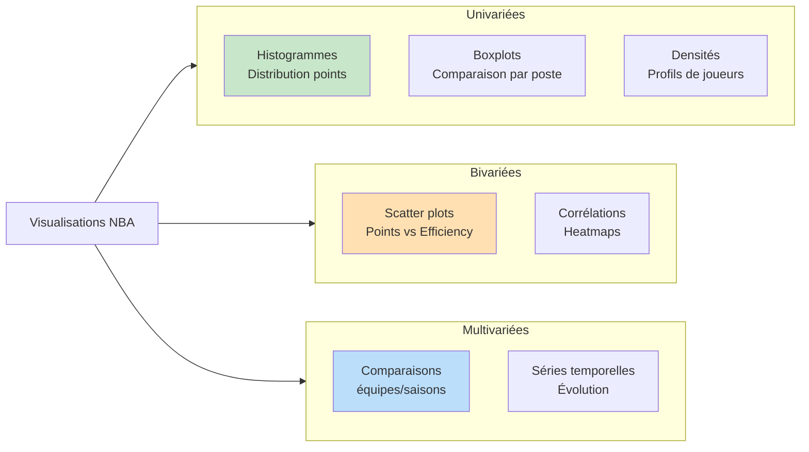

# Projet Transverse NBA — Analyse de Données Sportives

## _Introduction_

Ce rapport présente une **analyse de données transversale** sur la NBA (National Basketball Association), portant sur l'exploration et l'analyse de performances des joueurs et équipes. Ce projet illustre une approche complète de data analysis appliquée au domaine du sport professionnel.

### Objectifs et contexte

Le projet vise à :

1. **Explorer les données NBA** : Statistiques de joueurs, équipes, matchs
2. **Analyser les performances** : Identifier patterns et tendances
3. **Visualiser les résultats** : Créer des graphiques informatifs
4. **Dériver des insights** : Recommandations basées sur les données

Le terme **transverse** indique une analyse couvrant plusieurs dimensions (joueurs, équipes, saisons, statistiques).

---

## _Contenus principaux_

### Sections du rapport

1. **Exploration des données NBA** : Description du dataset
2. **Statistiques descriptives** : Analyse univariée par poste, équipe
3. **Corrélations** : Analyse bivariée des performances
4. **Visualisations** : Graphiques de distribution, tendances
5. **Insights et conclusions** : Patterns intéressants découverts

### Données analysées

- **Joueurs** : Statistiques individuelles (points, rebonds, passes, etc.)
- **Équipes** : Performances collectives, victoires/défaites
- **Saisons** : Évolution temporelle des performances
- **Postes** : Différences selon position de jeu

---

## _Accès et consultation_

Le rapport complet est disponible dans le fichier HTML : **AYOUBI_CHOUKOUKOU_Projet-Transverses-NBA.html**

### Comment ouvrir le fichier

1. **Double-cliquez** sur le fichier `.html` pour l'ouvrir dans votre navigateur
2. **Ou faites un clic-droit → Ouvrir avec → Navigateur web**
3. Les graphiques et tableaux s'afficheront automatiquement

### Recommandations de visualisation

- Utilisez un **navigateur moderne** (Chrome, Firefox, Safari, Edge)
- L'écran large (ordinateur) offre une meilleure expérience
- Vous pouvez **imprimer** le rapport complet en format PDF

---

## _Analyse approfondie_

### Statistiques exploratoires

- **Nombre de joueurs/équipes** analysés
- **Plage de saisons** couverte
- **Variables principales** : Points par match, efficacité, rebonds, assists
- **Groupements** : Par poste, équipe, saison

### Comparaisons multiples

- Performances par **poste de jeu**
- Évolution par **saisons**
- Disparités entre **équipes**
- Corrélations entre **statistiques**

### Visualisations clés

- **Histogrammes** : Distribution des points, rebonds, passes
- **Boxplots** : Comparaisons par groupe
- **Scatter plots** : Corrélations bivariées
- **Séries temporelles** : Évolution des performances
- **Heatmaps** : Corrélations multiples

---

## _Diagrammes d'analyse_

### Pipeline d'analyse NBA

### Types de graphiques inclus

---

## _Métriques NBA clés_

Les statistiques principales analysées incluent :

- **PPG** (Points Per Game) : Moyenne de points par match
- **RPG** (Rebounds Per Game) : Moyenne de rebonds
- **APG** (Assists Per Game) : Moyenne de passes décisives
- **FG%** (Field Goal Percentage) : Pourcentage de réussite au tir
- **3P%** : Pourcentage de réussite aux tirs à 3 points
- **EFG%** (Effective Field Goal %) : Efficacité globale de tir

---

## _Conclusions principales_

Ce rapport révèle les patterns clés des performances NBA, permettant une meilleure compréhension des :

1. **Performances individuelles** : Profils de joueurs par poste
2. **Efficacité d'équipe** : Facteurs de succès collectif
3. **Évolutions temporelles** : Trends sur plusieurs saisons
4. **Disparités de performance** : Écarts entre joueurs/équipes

---

## _Format et accessibilité_

- **Format** : Rapport HTML interactif
- **Taille** : ~3 MB
- **Navigateur** : Tous les navigateurs modernes supportés
- **Interactivité** : Graphiques exploratoires

---

**Auteur** : Ahmed Ay & Collaborateurs  
**Type** : Analyse de données transversale  
**Domaine** : Sports Analytics (NBA)  
**Format** : Rapport HTML avec visualisations
