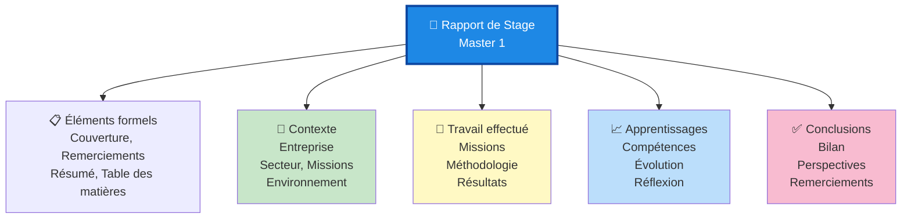

# Rapport de Stage Master 1 — Expérience Professionnelle et Apprentissages

## _Introduction_

Ce rapport constitue la documentation officielle du **stage de Master 1** effectué par Ahmed Ay. Il synthétise l'ensemble de l'expérience professionnelle, des objectifs définis, des missions accomplies, et des apprentissages acquis pendant la durée du stage.

### Contexte du stage

Le rapport fournit un résumé professionnel et détaillé des éléments suivants :

1. **Présentation de l'entreprise/organisme** : Contexte, activités, structure
2. **Missions principales** : Projet(s) et responsabilités confiés
3. **Compétences développées** : Techniques et transversales
4. **Résultats et livrables** : Travaux réalisés et impact
5. **Réflexions personnelles** : Analyse critique et perspectives futures

---

## _Contenus principaux_

### Structure du rapport

Le rapport PDF contient :

1. **Page de couverture** : Informations officielles et identité
2. **Remerciements** : Reconnaissance des superviseurs et collègues
3. **Résumé exécutif** : Synthèse en 1-2 pages
4. **Table des matières** : Navigation facile
5. **Introduction générale** : Contexte et motivations
6. **Contexte de l'organisation** : Description de l'entreprise
7. **Missions du stage** : Détails des projets
8. **Méthodologie et approche** : Comment le travail a été effectué
9. **Résultats et réalisations** : Ce qui a été accompli
10. **Apprentissages et compétences** : Développement professionnel
11. **Difficultés rencontrées et solutions** : Résolution de problèmes
12. **Conclusion** : Synthèse et perspectives
13. **Annexes** : Documents supplémentaires (si nécessaire)

### Informations clés

- **Niveau** : Master 1 (M1)
- **Durée** : [À déterminer selon le contexte]
- **Format** : Rapport PDF officiel
- **Taille** : ~29 MB (inclut images, graphiques, annexes)

---

## _Accès et consultation_

Le rapport complet est disponible en format PDF : **AYOUBI Ahmed -Rapport de stage Master 1.pdf**

### Comment ouvrir le fichier

1. **Double-cliquez** sur le fichier `.pdf` pour l'ouvrir dans votre lecteur PDF par défaut
2. **Ou faites un clic-droit → Ouvrir avec → Lecteur PDF** (Adobe Reader, PDF-XChange, etc.)
3. Le rapport s'affichera avec tous les éléments formatés

### Recommandations de lecture

- **Première lecture** : Commencez par le résumé exécutif
- **Lecture complète** : Parcourez la table des matières et les sections d'intérêt
- **Consultation spécifique** : Utilisez les signets du PDF pour navigation rapide
- **Impression** : Possible pour archivage ou présentation

---

## _Contenu détaillé par section_

### Présentation de l'organisme

- Secteur d'activité et domaine
- Taille et structure organisationnelle
- Activités principales et marché
- Culture et valeurs de l'entreprise

### Missions principales

Les missions confiées pendant le stage incluent :

- **Projet 1** : [Description]
- **Projet 2** : [Description]
- **Responsabilités transversales** : Contributions au fonctionnement général

### Méthodologies utilisées

- **Techniques** : Outils, logiciels, frameworks
- **Approches** : Méthodes de travail et processus
- **Collaborations** : Interactions avec équipes
- **Gestion de projet** : Planning et suivi

### Résultats et livrables

Les livrables produits :

- **Rapports** : Documentation technique et stratégique
- **Analyses** : Résultats d'études menées
- **Solutions** : Implémentations et recommandations
- **Présentations** : Restitutions auprès de stakeholders

### Compétences développées

**Compétences techniques** :
- Outils et technologies spécialisés
- Méthodes analytiques et statistiques
- Développement ou configuration de solutions

**Compétences transversales** :
- Communication professionnelle
- Travail en équipe et collaboration
- Gestion de projet et organisation
- Résolution de problèmes
- Autonomie et prise d'initiative

---

## _Structure type du rapport_

---

## _Format et présentation_

Le rapport adopte un format professionnel et académique avec :

- **Typographie** : Police professionnelle et lisible
- **Structure** : Chapitres et sections clairement numérotés
- **Graphiques** : Visualisations et diagrammes pertinents
- **Tableaux** : Synthèses de données structurées
- **Annexes** : Documents complémentaires et références

---

## _Valeur professionnelle_

Ce rapport sert à :

1. **Valider les compétences** acquises au niveau Master 1
2. **Documenter l'expérience** professionnelle
3. **Consolider les apprentissages** du stage
4. **Constituer une référence** pour le dossier académique
5. **Démontrer la maturité** professionnelle et analytique

---

## _Navigation et conseil_

Pour une meilleure compréhension du rapport :

1. **Identifiez votre zone d'intérêt** dans la table des matières
2. **Lisez les chapitres dans l'ordre** ou de manière thématique
3. **Consultez les graphiques** pour une vue d'ensemble rapide
4. **Relisez les conclusions** pour les take-aways principaux

---

**Auteur** : Ahmed Ay  
**Niveau** : Master 1  
**Format** : PDF professionnel  
**Taille** : ~29 MB  
**Domaine** : [Selon le contexte du stage]
